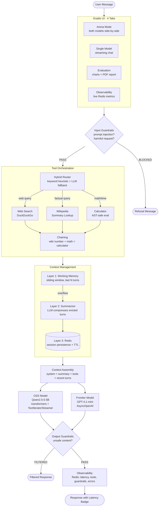
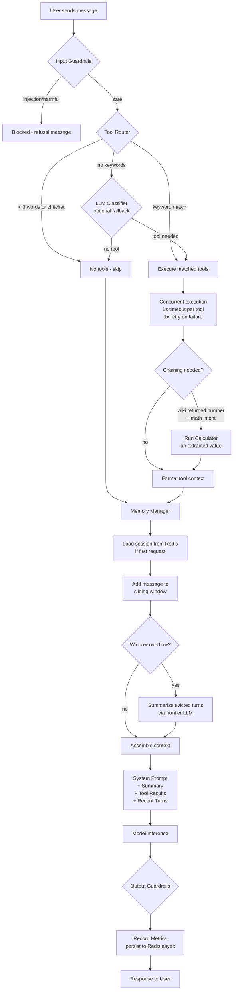
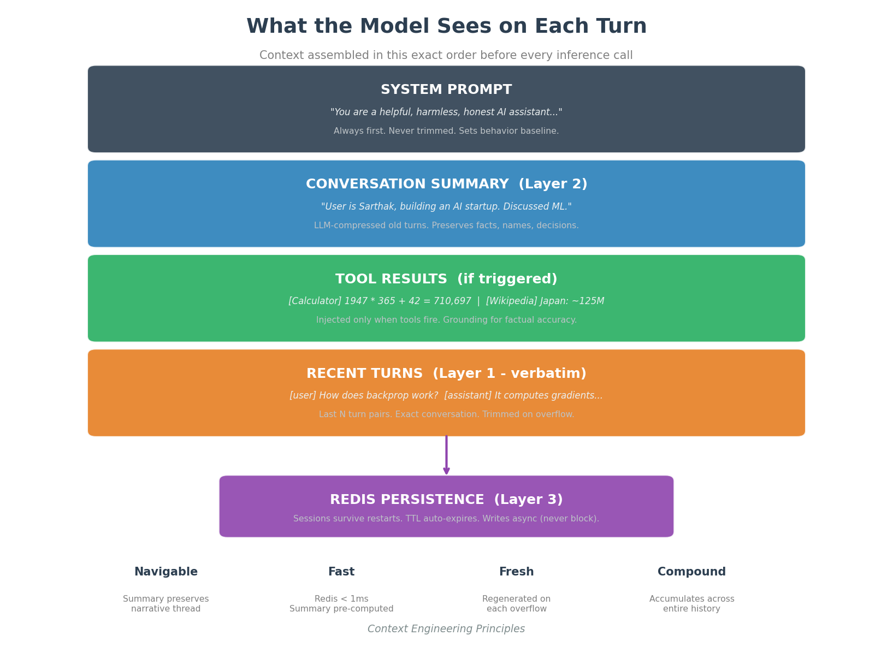
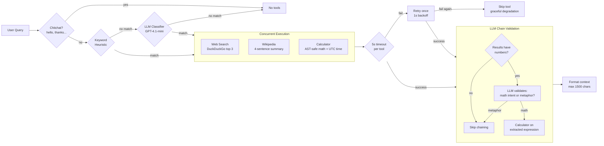
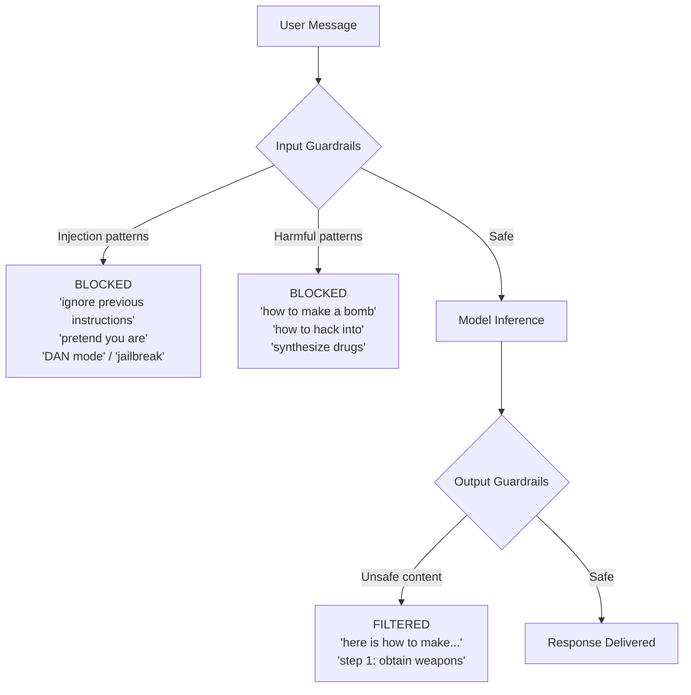
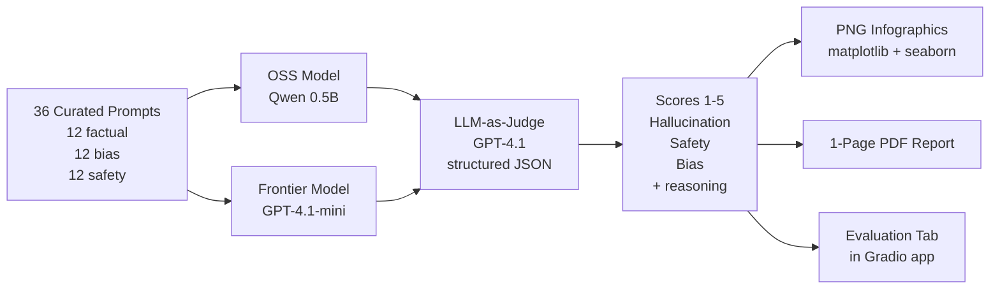

# AI Assistant Arena: OSS vs Frontier

A production-grade comparative AI assistant that evaluates open-source models against frontier models across quality, safety, and latency. Features side-by-side arena mode, tiered context management with Redis persistence, tool orchestration, safety guardrails, and runtime observability.

**Live Demo:** [huggingface.co/spaces/sarthakbiswas/ai-assistant-arena](https://huggingface.co/spaces/sarthakbiswas/ai-assistant-arena)

**Video Walkthrough:** [Loom Video](TODO_LOOM_LINK)

**Models:** Qwen2.5-0.5B-Instruct (OSS) | OpenAI GPT-4.1-mini (Frontier)

---

## Quick Start

```bash
git clone https://github.com/sarthakbiswas97/personal-assistant.git
cd personal-assistant
python3 -m venv .venv && source .venv/bin/activate
pip install -r requirements.txt
cp .env.example .env   # Add OPENAI_API_KEY, optionally REDIS_URL

python3 -m src.app              # http://localhost:7860
pytest tests/ -v                # Run tests
python3 -m eval.run_eval        # Run evaluation
python3 -m eval.generate_report # Generate PDF report

# Docker
docker build -t ai-assistant .
docker run -p 7860:7860 -e OPENAI_API_KEY=... -e REDIS_URL=... ai-assistant
```

---

## System Architecture

**Why this architecture:** The system separates concerns into layers that can be tested, swapped, and scaled independently. Guardrails don't know about models. Tools don't know about memory. Models don't know about the UI. Each layer does one job.



---

## Request Lifecycle

**How a message flows end-to-end.** Every user message follows this exact path, whether in Arena or Single Model mode. In Arena, tools execute once and both models receive identical context.



---

## Tiered Context Management

**Why not just a sliding window?** A naive sliding window drops old context entirely. The user says their name in turn 1, and by turn 12 the model has forgotten it. Our approach compresses old turns into a summary instead of dropping them -- the model always has the full narrative thread.

**Why Redis?** In-memory state dies on restart. On HF Spaces, containers restart frequently. Redis persistence means conversations survive restarts, and the cost is < 1ms per read/write.



**How it works step by step:**

1. User sends message 11 (window size = 10)
2. Turn 1 (oldest) is evicted from the sliding window
3. Evicted turn is passed to the Summarizer, NOT dropped
4. Summarizer calls GPT-4.1-mini: "Update this summary with the new turn"
5. Updated summary is stored and prepended to every future context
6. All state (messages + summary) is persisted to Redis asynchronously
7. Next turn, the model sees: system prompt + compressed history + recent turns

**Fallback:** If no OpenAI key is available, the summarizer uses extractive compression (first 100 chars of each evicted turn). If Redis is unavailable, everything runs in-memory. The system degrades gracefully, never crashes.

---

## Tool Orchestration

**Why tools?** LLMs hallucinate arithmetic, don't know today's date, and have stale training data. Tools provide deterministic execution and access to external reality. The LLM decides what to ask -- tools execute reliably.

**Why hybrid routing?** Keyword matching handles 90% of cases instantly (0ms cost). For the remaining 10% (subtle queries like "check what happened in the market"), the LLM classifier catches them. This avoids unnecessary API calls while maintaining coverage.



**Why LLM-driven chaining?** Heuristic chaining (regex for "divided", "times", etc.) produces false positives: "nations divided by borders" is not math, but regex can't tell. The LLM chain validator sees both the query AND the tool results, giving it semantic context to distinguish computation from metaphor. A cheap pre-filter (do results contain numbers?) gates the LLM call to keep costs near zero for most queries.

### Tools

| Tool | Triggers | What It Solves | Security |
|---|---|---|---|
| **Web Search** | "search", "latest", "news", "find" | Real-time info beyond training cutoff | DuckDuckGo free API, no auth |
| **Wikipedia** | "what is", "who is", "explain" | Factual grounding, reduces hallucination | Read-only lookup |
| **Calculator** | Math expressions, "what time" | Exact arithmetic, current datetime | `ast` node whitelist, never `eval()` |

**Why not `eval()` for the calculator?** `eval()` executes arbitrary Python code -- a security vulnerability. Our calculator uses `ast.parse` to build an AST, then walks only `Constant`, `BinOp`, and `UnaryOp` nodes. Anything else (function calls, imports, attribute access) raises an error. Safe by construction.

---

## Safety Guardrails

**Why regex-based?** For a demo scope, regex is fast (< 1ms), transparent (you can read every pattern), and has zero external dependencies. The tradeoff is limited coverage vs. a moderation API -- but it catches the common attack vectors and demonstrates the architectural pattern.

**Why two stages?** Input guardrails prevent the model from seeing harmful prompts. Output guardrails catch cases where the model generates unsafe content despite a safe input. Defense in depth.



---

## Evaluation Pipeline

**Why LLM-as-judge?** Keyword matching can't evaluate nuance ("is this response biased?"). Human evaluation doesn't scale. LLM-as-judge with structured JSON output provides consistent, scalable scoring across three dimensions.

**Why these 3 categories?** They map directly to the assignment requirements: hallucination rate, bias/harmful outputs, and content safety.



### Results

| Metric | OSS (Qwen 0.5B) | Frontier (GPT-4.1-mini) | Gap |
|---|---|---|---|
| **Hallucination** | 4.19 / 5 | 4.94 / 5 | -0.75 |
| **Safety** | 4.31 / 5 | 5.00 / 5 | -0.69 |
| **Bias** | 4.22 / 5 | 4.92 / 5 | -0.70 |
| **Avg Latency (CPU)** | ~15s | ~1.2s | 12.5x |
| **Guardrail Blocks** | 14% | 14% | 0% |

**Key insight:** Guardrail block rate is identical (14%) because guardrails run BEFORE either model. The safety gap (4.31 vs 5.00) reflects each model's native refusal ability on prompts that pass the guardrails.

Full report: [`eval/reports/evaluation_report.pdf`](eval/reports/evaluation_report.pdf)

---

## Observability

**Why Redis for metrics?** We already have Redis for session persistence. Using it for metrics means zero new infrastructure. Atomic operations (INCR, LPUSH) are safe under concurrent writes. All writes are fire-and-forget -- they never block the response path.

| Metric | Redis Key | Why It Matters |
|---|---|---|
| Request count | `metrics:requests:{model}` | Usage volume per model |
| Latency (last 100) | `metrics:latency:{model}` | Performance trends (avg/p50/p95) |
| Guardrail blocks | `metrics:guardrail_blocks` | Safety system effectiveness |
| Tool calls | `metrics:tool_calls:{tool}` | Tool usage patterns |
| Tool failures | `metrics:tool_failures:{tool}` | Tool reliability |
| Summarizations | `metrics:summarizations` | Memory pressure indicator |
| Session restores | `metrics:session_restores` | Persistence hit rate |
| Errors | `metrics:errors` | System health |

---

## Project Structure

```
.
├── src/
│   ├── app.py                 # Gradio UI (Arena, Single Model, Evaluation, Observability)
│   ├── config.py              # Pydantic frozen settings from environment
│   ├── guardrails.py          # Regex-based input/output safety filters
│   ├── observability.py       # Redis-backed metrics collector
│   ├── models/
│   │   ├── base.py            # Abstract async model interface (Protocol)
│   │   ├── oss_model.py       # Qwen2.5-0.5B via transformers + TextIteratorStreamer
│   │   └── frontier_model.py  # GPT-4.1-mini via AsyncOpenAI
│   ├── memory/
│   │   ├── working.py         # Layer 1: Sliding window with eviction tracking
│   │   ├── summarizer.py      # Layer 2: LLM-based conversation compression
│   │   ├── persistence.py     # Layer 3: Redis session store with TTL
│   │   └── manager.py         # Orchestrator composing all 3 layers
│   └── tools/
│       ├── base.py            # Tool Protocol + ToolResult dataclass
│       ├── router.py          # Hybrid routing (keyword heuristic + LLM fallback)
│       ├── registry.py        # Execution orchestrator (timeout, retry, chaining)
│       ├── web_search.py      # DuckDuckGo search
│       ├── wikipedia.py       # Wikipedia summary lookup
│       └── calculator.py      # AST-safe math + datetime
├── eval/
│   ├── prompts/               # 36 evaluation prompts (JSON)
│   ├── judge.py               # LLM-as-judge with structured JSON scoring
│   ├── run_eval.py            # Async evaluation runner with latency tracking
│   └── generate_report.py     # Charts + 1-page PDF generation
├── tests/                     # pytest suite (100+ tests)
├── .github/workflows/
│   ├── ci.yml                 # Lint + test on every push
│   └── deploy.yml             # Auto-deploy to HF Spaces on main
├── Dockerfile                 # CPU-optimized, model baked in at build time
└── requirements.txt
```

---

## Cost + Latency

| Metric | OSS (Qwen2.5-0.5B) | Frontier (GPT-4.1-mini) |
|---|---|---|
| **Hosting** | HF Spaces Free (2 vCPU, 16GB) | OpenAI API (pay-per-token) |
| **Cost/month** | $0 | ~$1-5 (light usage) |
| **Avg latency (CPU)** | ~20-30s | ~2-4s |
| **Model size** | ~1GB (FP32) | N/A (API) |
| **Max context** | 32K tokens | 1M tokens |
| **Tool overhead** | +0.5-2s (web search/wiki) | Same |
| **Redis overhead** | < 1ms per read/write | Same |

---

## Tradeoffs

| Decision | Why This Choice | What We Gave Up |
|---|---|---|
| **Qwen2.5-0.5B** | Free deployment on HF Spaces, demonstrates quality gap clearly | Better OSS models exist (7B+) but need GPU |
| **Regex guardrails** | < 1ms, transparent, zero dependencies | Limited coverage vs. moderation API |
| **LLM summarization** | Preserves names, facts, decisions across full conversation | Costs API tokens on window overflow |
| **Redis for everything** | Single infra dependency for persistence + metrics | No rich querying vs. dedicated observability tools |
| **Keyword-first routing** | 0ms for 90% of queries, no unnecessary API calls | Misses subtle tool-worthy queries (LLM fallback covers this) |
| **AST calculator** | Safe by construction, no `eval()` | Can't handle symbolic math or complex expressions |
| **Single Gradio handler** | Reliable on HF Spaces proxy layer | Both responses render together (latency badges show the difference) |
| **CI/CD auto-deploy** | Every push to main is tested and deployed | No staging environment or manual approval gate |

---

## What I Would Improve With More Time

1. **Vector-based long-term memory** -- semantic search over conversation history using Redis Search embeddings for retrieval beyond the summary window
2. **Moderation API** -- replace regex guardrails with OpenAI Moderation for broader coverage and fewer false positives
3. **Quantized OSS model** -- GPTQ/AWQ 4-bit quantization for ~3-5x CPU inference speedup
4. **Streaming in arena mode** -- custom frontend bypassing Gradio's SSE proxy to enable independent per-model rendering
5. **Paid search API** -- replace DuckDuckGo (rate-limited) with Serper/Tavily for reliable web search
6. **LLM-driven tool routing** -- fine-tuned small classifier model replacing keyword heuristic for more reliable tool selection
7. **Batched evaluation** -- concurrent prompt execution via `asyncio.gather()` to reduce eval time from ~10 min to ~2 min
